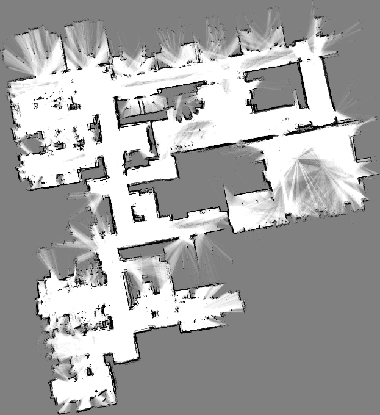
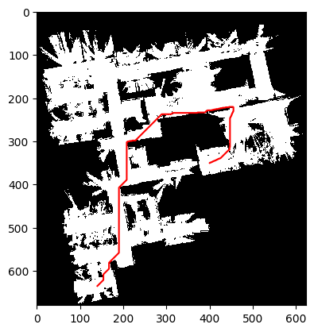
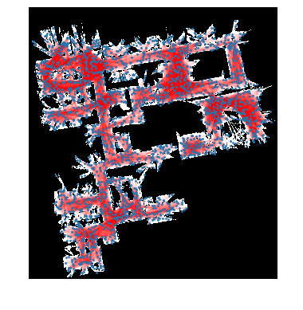
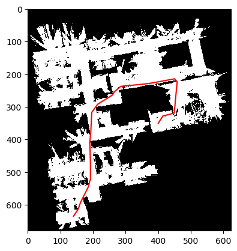

# Path Planning in Occupancy Grid Maps using A\* and Probabilistic Roadmaps (PRM)

Goal of the project is to implement two powerful path planning algorithms—**A\*** and **Probabilistic Roadmaps (PRM)** , designed to navigate a robot through a 2D binary occupancy grid map. These algorithms are applied to environments with obstacles, enabling the robot to find collision-free paths from a specified start to goal location.

## Overview

The implemented system supports:

* **A\*** search on 8-connected occupancy grids
* **PRM-based planning** using random sampling and graph search
* **Visualizations** of planned paths over the environment map
* **Euclidean cost functions** for realistic motion estimates

---

## Environment Description

* The environment is a 2D **binary occupancy map**.
* `0` indicates **obstacles** (occupied cells).
* `1` indicates **free space** (navigable cells).
* The robot can move to **any 8-connected neighbor** that is free.

---

## Grid Maps Used

<p align="center">
  
  
</p>

<p align="center">
  <strong>Left:</strong> Original Probabilistic Environment &nbsp;&nbsp;&nbsp;&nbsp;
  <strong>Right:</strong> Thresholded Binary Occupancy Map
</p>

---

## Problem Definition

Implemented two algorithms to compute the shortest feasible path from:

* **Start location**: `(635, 140)`
* **Goal location**: `(350, 400)`

The system must:

1. Identify valid neighbor nodes (based on connectivity and occupancy).
2. Calculate transition costs using Euclidean distance.
3. Handle both grid-based (A\*) and graph-based (PRM) search processes.

---

##  Features

### A\* Search

* Designed for discrete 8-connected grids.
* Uses a **priority queue** and **heuristic-guided search**.
* Guarantees **optimal** paths when the heuristic is admissible.
* Uses Euclidean distance as both the **edge cost** and **heuristic**.

### Probabilistic Roadmaps (PRM)

* Samples random **free-space nodes**.
* Builds a graph using **reachability tests** within a fixed radius.
* Adds start and goal nodes to the graph.
* Runs A\* on the constructed roadmap.
* Capable of **scaling** to complex or high-dimensional maps.

---

##  Algorithm Details

### A\* Search on Grid

1. **N(v)** – Finds all valid 8-connected free neighbors.
2. **d(v1, v2)** – Computes Euclidean distance.
3. **h(v, g)** – Admissible heuristic (straight-line to goal).
4. **recover\_path()** – Backtracks from goal using predecessor mapping.
5. **A\_star()** – Main loop using priority queue.

### Probabilistic Roadmap (PRM)

1. **sample\_vertex(M)** – Uniformly samples from free cells.
2. **is\_reachable(v1, v2)** – Uses line collision checking to validate edges.
3. **construct\_prm()** – Samples `N` nodes and connects edges within `dmax` distance.
4. **add\_start\_goal()** – Adds start and goal as graph nodes.
5. **graph\_search()** – Uses NetworkX’s A\* over the PRM graph.

##  How to Run

### Prerequisites

Install Python dependencies:

```bash
pip install numpy matplotlib pillow networkx
```

### Run the Code

Open the Jupyter notebook:

```bash
jupyter notebook Pathplanning.ipynb
```

Follow the cells step by step to:

* Load and preprocess the map
* Execute A\* and PRM planning
* Visualize the planned paths and graphs

---

##  Results

### A\* Results

* **Path Length**: Calculated using Euclidean cost
* **Visualization**: Shortest path overlaid on grid map
* **Optimality**: Always produces the lowest-cost path in the grid

* The shortest path in the occupancy grid from the starting point s = (635, 140) to the goal g = (350, 400) is plotted below such that this optimal path is overlaid on the binary occupancy image, and its total length is then calculated.
  
<p align="center">
  
</p>

### Distance of the path

* **Shortest possible distance**:  385.77843381920667
* **Distance covered by shortest possible path:**  803.1147904132627

---
### PRM Results

* **Graph**: 2500 random free points, `dmax = 75` pixels
* **Graph Planning**: Start and goal connected via local planner
* **Visualization**: PRM structure and path displayed on map
* **Performance**: Faster on sparse or high-dimensional spaces

* Constructed a PRM on the occupancy grid with N = 2500 samples and a maximum local search radius of dmax = 75 voxels. Plotted the resulting graph overlaid on binary occupancy grid map

<p align="center">
  
</p>

* Constructing a PRM, finding a path from s = (635, 140) to g = (350, 400). Plotting this path overlaid on binary occupancy map, and calculating its total length


<p align="center">
  
</p>

### Distance of the path

**Distance covered by shortest possible path:  789.3816774747326
---

## Testing

* Tested on a real-world occupancy map (converted to binary)
* Both algorithms validated for accuracy and performance
* Verified edge reachability, neighbor connectivity, and heuristic consistency

---

## Future Improvements

* Extend to 3D occupancy maps (e.g., voxel grids)
* Integrate motion constraints (e.g., Dubins paths for car-like robots)
* Compare against other planners (RRT, Dijkstra)
